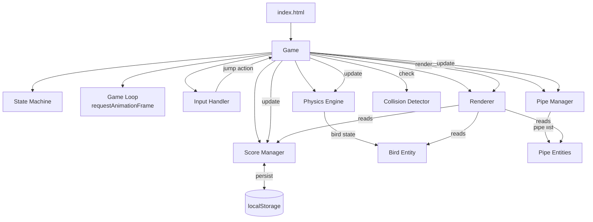
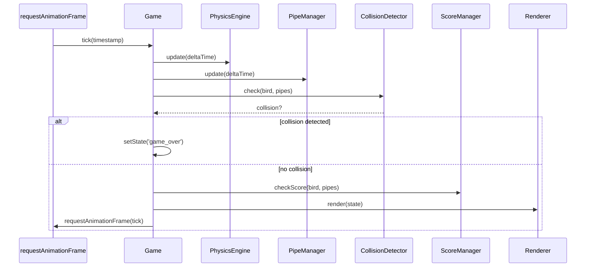

# Design Document: Flappy Bird Game

## Overview

Implementación de un videojuego estilo Flappy Bird como aplicación web de una sola página (SPA) usando únicamente HTML5, CSS3 y JavaScript vanilla. El juego se renderiza sobre un elemento `<canvas>` de 480 × 640 píxeles y sigue un ciclo de estados bien definido: `idle` → `playing` → `game_over` → `idle`.

La arquitectura sigue el patrón **Component-Based Game Architecture** con separación clara de responsabilidades entre física, renderizado, entrada, gestión de tuberías y puntuación. Todos los componentes se coordinan a través de un objeto `Game` central que actúa como orquestador y máquina de estados.

### Objetivos de diseño

- **Simplicidad**: Sin dependencias externas; todo en HTML, CSS y JS vanilla.
- **Separación de responsabilidades**: Cada componente tiene una única responsabilidad bien definida.
- **Testabilidad**: La lógica de negocio (física, colisiones, puntuación) está desacoplada del DOM y del canvas para facilitar las pruebas.
- **Rendimiento**: Game loop a 60 FPS usando `requestAnimationFrame` con delta-time para consistencia entre dispositivos.
- **Accesibilidad**: Soporte multi-input (teclado, ratón, táctil) y atributos ARIA básicos.

---

## Architecture

El juego sigue una arquitectura de componentes coordinados por un orquestador central. No se usa ningún framework; la comunicación entre componentes es directa (llamadas a métodos) para mantener la simplicidad.



### Flujo del Game Loop



### Estructura de archivos

```
flappy-bird/
├── index.html          # Punto de entrada, canvas, estructura DOM
├── css/
│   └── style.css       # Estilos del canvas, centrado, responsive
└── js/
    ├── main.js         # Bootstrap: instancia Game y arranca
    ├── game.js         # Orquestador principal + State Machine
    ├── bird.js         # Entidad Bird (posición, velocidad)
    ├── pipe.js         # Entidad Pipe (par superior/inferior)
    ├── physics.js      # Physics Engine (gravedad, velocidad)
    ├── pipeManager.js  # Pipe Manager (generación, movimiento, limpieza)
    ├── collision.js    # Collision Detector (AABB + hitbox reducida)
    ├── scoreManager.js # Score Manager (score, high score, localStorage)
    ├── inputHandler.js # Input Handler (teclado, ratón, táctil)
    └── renderer.js     # Renderer (canvas 2D API)
```

---

## Components and Interfaces

### Game (Orquestador + State Machine)

Clase central que coordina todos los componentes y gestiona el ciclo de vida del juego.

```javascript
class Game {
  constructor(canvas)
  
  // State Machine
  getState()                    // → 'idle' | 'playing' | 'game_over'
  setState(newState)            // Valida transición y actualiza estado
  
  // Lifecycle
  init()                        // Inicializa todos los componentes
  start()                       // Transición idle → playing
  reset()                       // Reinicia componentes, vuelve a idle
  
  // Game Loop
  tick(timestamp)               // Llamado por requestAnimationFrame
  update(deltaTime)             // Actualiza física, tuberías, colisiones, score
  
  // Event handlers (llamados por InputHandler)
  onJumpAction()                // Delega según estado actual
}
```

**Transiciones de estado válidas:**

```
idle       → playing    (acción de salto)
playing    → game_over  (colisión detectada)
game_over  → idle       (acción de reinicio/salto)
```

Cualquier otra transición lanza un error o se ignora silenciosamente.

---

### Bird (Entidad)

Objeto de datos puro que representa el estado del pájaro. No contiene lógica de física ni renderizado.

```javascript
class Bird {
  constructor(x, y, radius)
  
  // Propiedades
  x           // Posición horizontal (fija durante el juego)
  y           // Posición vertical (cambia con física)
  radius      // Radio para renderizado y colisión
  velocity    // Velocidad vertical actual (px/frame)
  
  // Métodos
  reset()     // Restaura posición y velocidad iniciales
  getBoundingBox(margin)  // → {x, y, width, height} con hitbox reducida
}
```

---

### PhysicsEngine

Aplica gravedad y actualiza la posición del Bird. Opera únicamente sobre el objeto Bird.

```javascript
class PhysicsEngine {
  constructor(gravity, jumpVelocity, maxFallVelocity)
  // Defaults: gravity=0.5, jumpVelocity=-8, maxFallVelocity=12
  
  update(bird)      // Aplica gravedad y actualiza posición Y
  jump(bird)        // Asigna jumpVelocity al bird
  reset()           // Sin estado interno que resetear
}
```

**Algoritmo de update:**
```
bird.velocity = clamp(bird.velocity + gravity, -Infinity, maxFallVelocity)
bird.y += bird.velocity
```

---

### Pipe (Entidad)

Representa un par de tuberías (superior + inferior) con un gap entre ellas.

```javascript
class Pipe {
  constructor(x, canvasHeight, gapY, gapHeight, pipeWidth)
  
  // Propiedades
  x           // Posición horizontal (se mueve hacia la izquierda)
  gapY        // Posición Y del inicio del gap
  gapHeight   // Altura del gap (fija: 150px)
  width       // Ancho de la tubería
  scored      // Boolean: si ya se sumó punto por este pipe
  
  // Métodos
  getBoundingBoxTop()     // → {x, y, width, height} tubería superior
  getBoundingBoxBottom()  // → {x, y, width, height} tubería inferior
  isOffScreen(canvasWidth) // → boolean
}
```

---

### PipeManager

Gestiona el ciclo de vida de todos los pipes activos.

```javascript
class PipeManager {
  constructor(canvasWidth, canvasHeight, pipeSpeed, spawnInterval)
  // Defaults: pipeSpeed=3, spawnInterval=1500ms
  
  update(deltaTime)     // Mueve pipes, genera nuevos, elimina fuera de pantalla
  getPipes()            // → Pipe[] (lista de pipes activos)
  reset()               // Limpia todos los pipes y reinicia timer
  
  // Privados
  _spawnPipe()          // Crea nuevo pipe con gap aleatorio válido
  _calculateGapY()      // → número aleatorio respetando alturas mínimas (50px)
}
```

**Cálculo del gap:**
```
minPipeHeight = 50
gapHeight = 150
gapY = random(minPipeHeight, canvasHeight - gapHeight - minPipeHeight)
```

---

### CollisionDetector

Lógica de detección de colisiones AABB con hitbox reducida. Función pura sin estado.

```javascript
class CollisionDetector {
  // Margen de tolerancia: 4px en cada lado
  static HITBOX_MARGIN = 4
  
  static check(bird, pipes, canvasHeight)  // → boolean
  static _aabbIntersects(rectA, rectB)     // → boolean
  static _checkBoundaries(bird, canvasHeight) // → boolean (suelo/techo)
}
```

---

### ScoreManager

Gestiona la puntuación actual y el récord, con persistencia en localStorage.

```javascript
class ScoreManager {
  constructor(storageKey)
  // Default storageKey: 'flappyBirdHighScore'
  
  reset()                   // Score = 0, carga highScore de localStorage
  getScore()                // → number
  getHighScore()            // → number
  checkAndScore(bird, pipes) // Detecta si bird cruzó un pipe y suma punto
  saveHighScore()           // Persiste highScore en localStorage si es nuevo récord
}
```

**Lógica de puntuación:**
El bird "cruza" un pipe cuando `bird.x > pipe.x + pipe.width / 2` y `pipe.scored === false`. Se marca `pipe.scored = true` para no contar dos veces.

---

### InputHandler

Registra y desregistra event listeners. Notifica al Game mediante callback.

```javascript
class InputHandler {
  constructor(canvas, onJump)
  // onJump: función callback llamada cuando se detecta acción de salto
  
  attach()    // Registra event listeners (keydown, mousedown, touchstart)
  detach()    // Elimina event listeners
  
  // Privados
  _onKeyDown(e)    // Space o ArrowUp → onJump()
  _onMouseDown(e)  // Click izquierdo en canvas → onJump()
  _onTouchStart(e) // touchstart en canvas → onJump()
  _throttle()      // Previene múltiples saltos en el mismo frame
}
```

El throttle usa un flag `_jumpedThisFrame` que se resetea al inicio de cada tick del game loop.

---

### Renderer

Dibuja todos los elementos visuales en el canvas. Lee estado de los demás componentes pero no los modifica.

```javascript
class Renderer {
  constructor(canvas, ctx)
  
  render(state, bird, pipes, score, highScore)  // Dispatcher según estado
  
  // Privados
  _renderIdle()                    // Pantalla de inicio
  _renderPlaying(bird, pipes, score) // Frame de juego activo
  _renderGameOver(score, highScore)  // Pantalla de fin
  
  _drawBackground()    // Gradiente de cielo
  _drawBird(bird)      // Círculo/sprite del pájaro
  _drawPipes(pipes)    // Tuberías verdes con borde oscuro
  _drawGround()        // Franja inferior
  _drawScore(score)    // Score en esquina superior central
  _clearCanvas()       // Limpia el canvas completo
}
```

---

## Data Models

### GameState

```typescript
type GameState = 'idle' | 'playing' | 'game_over'
```

### BirdState

```typescript
interface BirdState {
  x: number        // Posición horizontal fija (ej: 80px)
  y: number        // Posición vertical dinámica
  radius: number   // Radio del círculo (15px → sprite 30×30)
  velocity: number // Velocidad vertical en px/frame
}
```

### PipeState

```typescript
interface PipeState {
  x: number        // Posición horizontal (decrece cada frame)
  gapY: number     // Y donde empieza el gap
  gapHeight: number // Altura del gap (150px fijo)
  width: number    // Ancho de la tubería (60px)
  scored: boolean  // Si ya se contabilizó el punto
}
```

### BoundingBox (AABB)

```typescript
interface BoundingBox {
  x: number
  y: number
  width: number
  height: number
}
```

### GameConfig

```typescript
interface GameConfig {
  canvas: {
    width: 480
    height: 640
  }
  bird: {
    startX: 80
    startY: 320
    radius: 15
  }
  physics: {
    gravity: 0.5        // px/frame²
    jumpVelocity: -8    // px/frame (negativo = arriba)
    maxFallVelocity: 12 // px/frame
  }
  pipes: {
    width: 60
    speed: 3            // px/frame
    spawnInterval: 1500 // ms
    gapHeight: 150      // px
    minPipeHeight: 50   // px
  }
  collision: {
    hitboxMargin: 4     // px de reducción por lado
  }
}
```

### ScoreState

```typescript
interface ScoreState {
  current: number
  high: number
}
```

---

## Correctness Properties

*Una propiedad es una característica o comportamiento que debe mantenerse verdadero en todas las ejecuciones válidas del sistema — esencialmente, una declaración formal sobre lo que el sistema debe hacer. Las propiedades sirven como puente entre las especificaciones legibles por humanos y las garantías de corrección verificables por máquinas.*

### Property 1: Transiciones de estado válidas

*Para cualquier* estado actual del juego (`idle`, `playing` o `game_over`) y cualquier acción de entrada (salto, colisión, reinicio), el sistema solo debe transicionar a un estado que sea válido según la secuencia definida (`idle` → `playing` → `game_over` → `idle`). El estado resultante siempre debe pertenecer al conjunto `{idle, playing, game_over}` y nunca debe saltarse pasos en la secuencia.

**Validates: Requirements 1.1, 1.3, 1.4, 1.5, 1.6**

---

### Property 2: La física del pájaro respeta la gravedad y los límites de velocidad

*Para cualquier* velocidad vertical inicial del pájaro y cualquier número de frames transcurridos sin salto, la velocidad vertical debe incrementarse en exactamente 0.5 px/frame por frame, nunca debe superar `maxFallVelocity` (12 px/frame), y la posición Y debe ser igual a la posición inicial más la suma acumulada de velocidades aplicadas frame a frame (con la restricción de velocidad máxima aplicada antes de sumar).

**Validates: Requirements 2.1, 2.3, 2.4**

---

### Property 3: El salto asigna siempre la velocidad correcta

*Para cualquier* estado del pájaro (posición y velocidad arbitrarias), tras aplicar la acción de salto, la velocidad vertical del pájaro debe ser exactamente -8 px/frame, independientemente de la velocidad previa.

**Validates: Requirements 2.2**

---

### Property 4: Las colisiones con los límites del canvas se detectan correctamente

*Para cualquier* posición del pájaro, si la posición Y supera el límite inferior del canvas (suelo) o es menor que 0 (techo), el detector de colisiones debe reportar una colisión; y si la posición Y está dentro de los límites, no debe reportar colisión por límites.

**Validates: Requirements 2.5, 2.6**

---

### Property 5: Los gaps de las tuberías siempre cumplen las restricciones de altura

*Para cualquier* par de tuberías generado por el PipeManager, la tubería superior debe tener al menos 50px de altura, la tubería inferior debe tener al menos 50px de altura, el gap entre ellas debe ser exactamente 150px, y la posición X inicial debe ser igual al ancho del canvas.

**Validates: Requirements 3.2, 3.3**

---

### Property 6: La detección de colisiones AABB con hitbox reducida es correcta y simétrica

*Para cualquier* par de rectángulos (bounding boxes), el algoritmo AABB debe detectar intersección si y solo si los rectángulos se solapan geométricamente. Además, para cualquier posición del pájaro, el bounding box con margen de tolerancia de 4px debe tener dimensiones estrictamente menores que el sprite completo y debe estar centrado dentro de él.

**Validates: Requirements 4.2, 4.3, 4.4**

---

### Property 7: Cada tubería contribuye exactamente un punto al score

*Para cualquier* secuencia de posiciones del pájaro y cualquier conjunto de tuberías activas, el score debe incrementarse en exactamente 1 punto cuando el pájaro cruza el eje central de un pipe por primera vez, y ese mismo pipe no debe volver a contribuir puntos aunque el pájaro permanezca a su derecha durante múltiples frames.

**Validates: Requirements 5.2**

---

### Property 8: El high score es el máximo histórico y se persiste correctamente

*Para cualquier* par de valores (score actual, high score previo), tras llamar a `saveHighScore()`, el valor almacenado en localStorage debe ser `max(scoreActual, highScorePrevio)`. Además, para cualquier valor de high score guardado, leerlo de localStorage debe devolver el mismo valor (round-trip de persistencia).

**Validates: Requirements 5.5, 5.6**

---

### Property 9: El throttle de input previene saltos duplicados en el mismo frame

*Para cualquier* número de eventos de salto disparados dentro del mismo frame del game loop, el callback de salto debe ser invocado como máximo una vez por frame, independientemente de cuántos eventos se reciban.

**Validates: Requirements 7.7**

---

### Property 10: El escalado del canvas mantiene la relación de aspecto 3:4

*Para cualquier* tamaño de ventana del navegador, el canvas debe escalar de forma que su ancho y alto mantengan siempre la relación de aspecto 3:4 (480:640), sin distorsión.

**Validates: Requirements 8.2**

---

## Error Handling

### Navegador sin soporte Canvas

Si `canvas.getContext('2d')` retorna `null`, el sistema muestra un mensaje de error en el DOM en lugar del canvas:

```html
<p class="no-canvas-error">
  Tu navegador no soporta HTML5 Canvas. Por favor, actualiza tu navegador.
</p>
```

### localStorage no disponible

Si `localStorage` no está disponible (modo privado en algunos navegadores, o error de cuota), el `ScoreManager` captura la excepción y opera en modo sin persistencia. El high score se mantiene en memoria durante la sesión pero no sobrevive entre sesiones.

```javascript
try {
  localStorage.setItem(this.storageKey, value)
} catch (e) {
  // Silently fail: high score persists in memory only
  console.warn('localStorage not available:', e)
}
```

### requestAnimationFrame no disponible

Fallback a `setTimeout(tick, 1000/60)` si `requestAnimationFrame` no está disponible (navegadores muy antiguos).

### Delta time anómalo

Si el delta time entre frames es mayor de 100ms (tab en segundo plano, etc.), se limita a 100ms para evitar que el juego "salte" al volver al primer plano.

```javascript
const deltaTime = Math.min(timestamp - lastTimestamp, 100)
```

### Errores no capturados

Un `window.onerror` global captura errores inesperados y muestra un mensaje de error al usuario en lugar de dejar el juego en estado inconsistente.

---

## Testing Strategy

### Enfoque dual: Unit Tests + Property-Based Tests

La lógica de negocio del juego (física, colisiones, puntuación, máquina de estados) es altamente testeable como funciones puras o casi-puras. Se usará un enfoque dual:

- **Unit tests**: Verifican comportamientos específicos, casos límite y condiciones de error.
- **Property-based tests**: Verifican propiedades universales sobre rangos amplios de inputs.

### Librería de Property-Based Testing

Se usará **[fast-check](https://github.com/dubzzz/fast-check)** para JavaScript, ejecutado con **Jest** como test runner.

```bash
npm install --save-dev jest fast-check
```

Cada property test se ejecutará con un mínimo de **100 iteraciones**.

### Módulos a testear

| Módulo | Tipo de test | Descripción |
|--------|-------------|-------------|
| `StateMachine` | Unit + Property | Transiciones válidas e inválidas |
| `PhysicsEngine` | Unit + Property | Gravedad, salto, límite de velocidad |
| `CollisionDetector` | Unit + Property | AABB, hitbox reducida, límites del canvas |
| `PipeManager` | Unit + Property | Generación de gaps válidos, movimiento |
| `ScoreManager` | Unit + Property | Incremento de score, persistencia high score |
| `Bird.getBoundingBox` | Unit + Property | Hitbox siempre menor que sprite |
| `Renderer` | Unit (snapshot) | Verificación de llamadas a canvas API |
| `InputHandler` | Unit | Eventos de teclado, ratón, táctil |

### Property Tests (referenciados al diseño)

Cada test de propiedad incluye un comentario de trazabilidad:

```javascript
// Feature: flappy-bird-game, Property 1: valid state transitions
test.prop([fc.constantFrom('idle', 'playing', 'game_over'), fc.string()])(
  'state machine only allows valid transitions',
  (currentState, action) => { ... }
)
```

**Tag format:** `Feature: flappy-bird-game, Property {N}: {property_text}`

### Unit Tests específicos

- **Física**: Verificar que tras exactamente N frames sin salto, la posición Y es la esperada.
- **Colisiones**: Casos límite donde el bird está exactamente en el borde del pipe.
- **Score**: Verificar que un pipe no se cuenta dos veces aunque el bird permanezca sobre él.
- **State Machine**: Verificar que transiciones inválidas (ej: `idle` → `game_over`) son rechazadas.
- **localStorage**: Mock de localStorage para verificar comportamiento cuando no está disponible.

### Tests de integración / smoke

- Verificar que el juego arranca sin errores en un entorno jsdom.
- Verificar que el canvas se escala correctamente al cambiar el tamaño de la ventana.
- Verificar que los event listeners se registran y desregistran correctamente.

### Cobertura objetivo

- Lógica de negocio (physics, collision, score, state): ≥ 90%
- Renderer e InputHandler: ≥ 70% (más difícil de testear sin DOM real)
